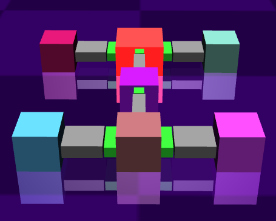
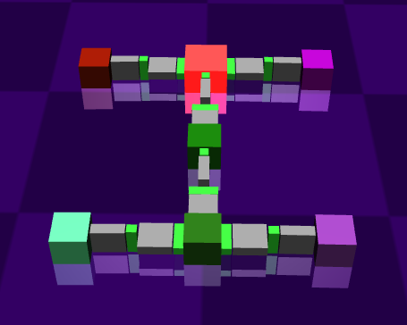
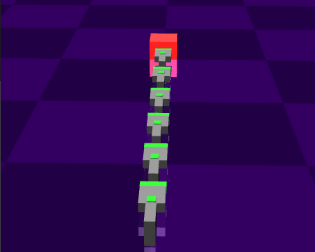

# Deep reinforcement learning for locomotion control in modular robots
This repository presents the implementation and evaluation of **DRL algorithms** for controlling the locomotion of modular robotic systems.  
The goal is to benchmark the adaptability, efficiency, and stability of DRL methods across different robot morphologies.

5 DRL algorithms were trained and analyzed on 3 distinct modular robot morphologies:
- 
- 
- 

